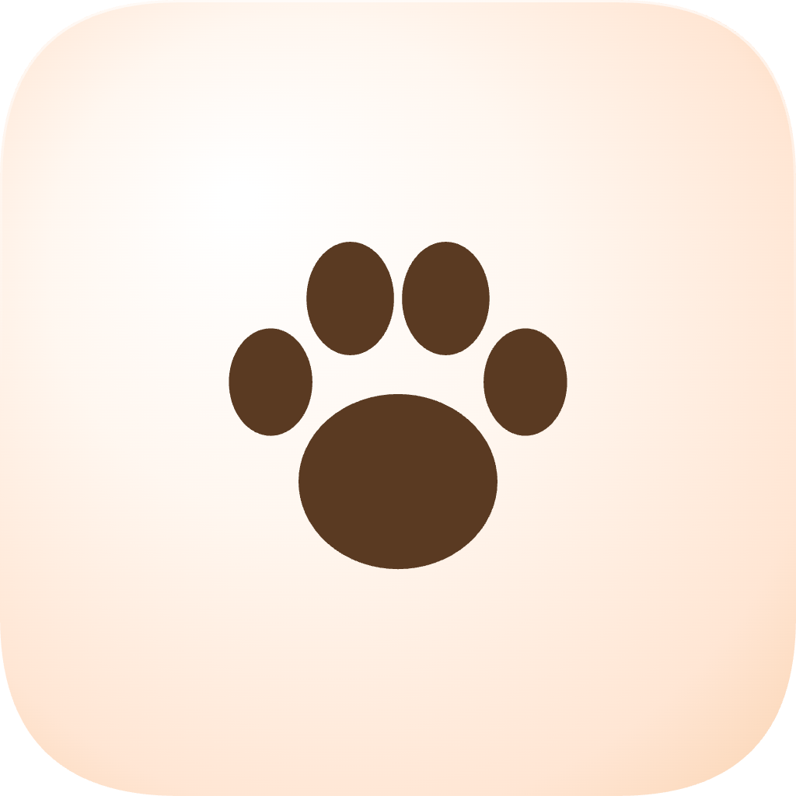

# Paws 🐾


<div align="center">
  
</div>


> Pause your keyboard. Wipe in peace.

Paws is a minimal macOS menu bar utility that locks your keyboard with one click - so you can wipe it down without triggering a nuclear launch.


---

## Features

- One-click keyboard lock from the menu bar
- Blocks all keypresses system-wide including modifier keys (Cmd, Shift, Option etc.)
- Menu bar icon changes to reflect locked/unlocked state
- Lightweight — lives in the menu bar, no Dock icon

## Limitations

- Volume and brightness keys cannot be blocked on modern Macs, this is a macOS restriction at the firmware level
- Not available on the Mac App Store (requires Accessibility permission, incompatible with App Sandbox)

---

## Requirements

- macOS 14 (Sonoma) or later
- Accessibility permission (prompted on first use)

---

## Installation

Download the latest release from the [Releases](../../releases) page, unzip, and drag **Paws.app** to your Applications folder.

Since Paws is not on the Mac App Store, macOS may warn you on first launch. To open it:

1. Right-click **Paws.app** in Finder
2. Select **Open**
3. Click **Open** in the dialog

---

## Build from source

1. Clone the repo
   ```bash
   git clone https://github.com/mabd-dev/paws.git
   ```
2. Open `Paws.xcodeproj` in Xcode
3. Select your development team in **Signing & Capabilities**
4. Run with `Cmd+R`

> Make sure App Sandbox is **disabled** in Signing & Capabilities — it is incompatible with global event taps.

---

## How it works

Paws uses a `CGEvent` tap at the HID level to intercept all keyboard events system-wide. When locked, the callback returns `nil` for every keypress, consuming the event so nothing else receives it. This requires macOS Accessibility permission, which the app will request on first use.

---

## Privacy

Paws does not log, store, or transmit any keystrokes. Events are consumed and discarded immediately.

---

## License

MIT — see [LICENSE](LICENSE)
